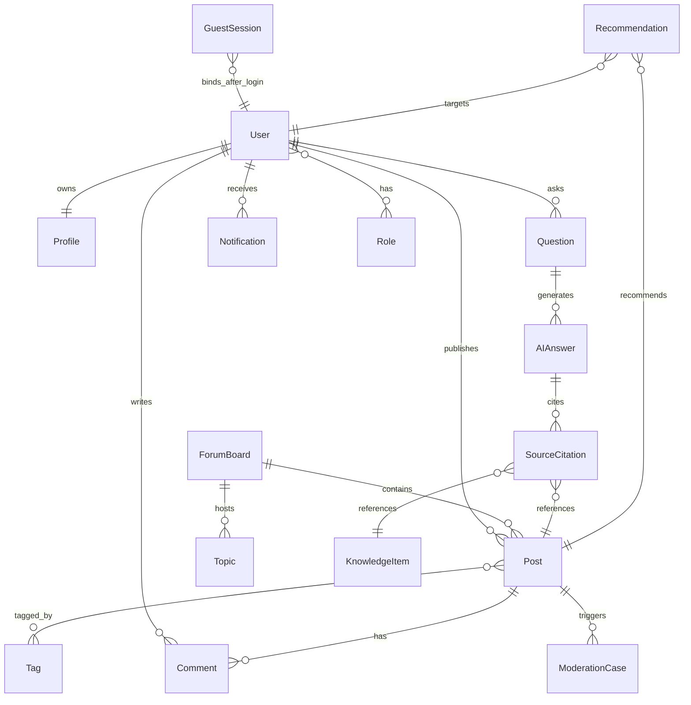
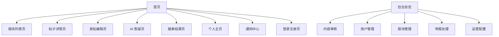
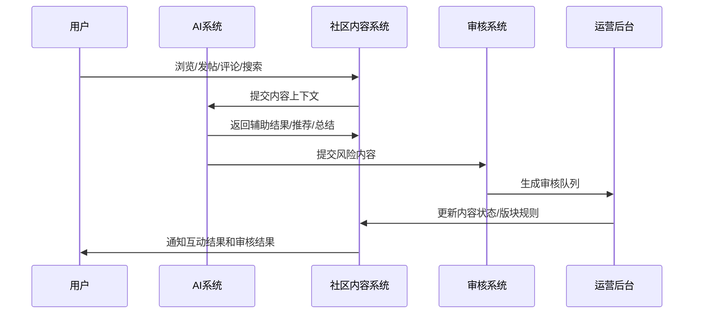
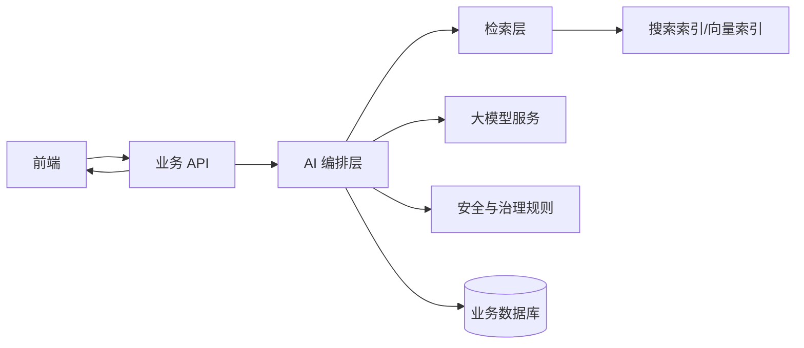

# AI 辅助论坛 PRD

## 1 产品哲学（Product Philosophy）

### 当前世界的问题本质

大众内容社区正在从“人找内容”进入“人、内容、AI 共同组织知识”的阶段。传统论坛依赖用户主动发帖、人工回复、手动搜索、人工治理，内容越多，信息越碎，优质内容越难被发现，新用户越难判断哪里值得参与。

综合内容社区的核心矛盾不是缺少内容，而是缺少持续把内容转化为可讨论、可引用、可沉淀知识的系统。用户发帖时缺少表达辅助，提问时等待时间长，浏览时被无序信息淹没，运营侧在广告、灌水、重复内容和争议内容中消耗大量人力。

### 现有方案的问题

| 产品类型 | 优势 | 核心问题 |
|----------|------|----------|
| 传统论坛 | 结构清晰，主题沉淀强 | 发帖门槛高，搜索效率低，内容治理重 |
| 问答社区 | 问题导向明确，答案可沉淀 | 内容生产周期长，长尾问题响应慢 |
| 内容流社区 | 消费效率高，推荐强 | 讨论结构弱，知识沉淀差，容易放大情绪内容 |
| AI 问答工具 | 即时回答，使用成本低 | 缺少真实用户经验、社区讨论和长期内容资产 |

### 本产品的范式改变

本产品把论坛从“帖子容器”升级为“AI 辅助的公共讨论与知识沉淀系统”。AI 不作为单独入口存在，而是嵌入发帖、答疑、搜索、推荐和治理流程，让用户在自然社区行为中获得辅助。

产品的长期价值来自三层结构：用户贡献真实经验，社区形成讨论关系，AI 持续整理、引用、推荐和治理内容。每一条帖子既是讨论单元，也是可被 AI 引用、检索和再组织的知识资产。

### 一句话核心理念（Slogan）

让每一次讨论，都沉淀成可被发现、可被引用、可被继续生长的知识。

---

## 2 问题陈述（Problem Statement）

### 用户当前真实工作和行为方式

大众兴趣用户遇到问题时，会在搜索引擎、社交平台、论坛、短视频评论区之间来回切换。他们搜索旧帖子，翻看零散评论，复制问题给 AI，再回到社区验证答案是否可信。内容创作者发布经验时，需要自己组织结构、起标题、选标签、找版块，表达能力直接影响内容被看见的机会。

社区运营者每天面对大量新帖、评论、举报和版块内容，需要判断内容是否低质、是否重复、是否违规、是否值得推荐。传统后台只提供列表和筛选工具，无法在内容进入流量分发前完成智能分级。

### 为什么低效 / 失控

信息低效来自三类断层：提问者和回答者之间有时间断层，内容消费者和历史优质内容之间有检索断层，运营者和海量内容之间有治理断层。传统社区把这些问题交给用户耐心和人工运营处理，规模进入万级用户后，人工响应速度、内容质量和社区秩序同时下降。

AI 工具解决了即时回答，却没有解决社区可信度、真实经验和长期讨论的问题。社区解决了人的参与，却没有解决实时解释、内容组织和机器辅助治理的问题。本产品把两者合并为一个可持续运转的社区系统。

### 典型失败场景

晚上 11 点，一个用户因为租房纠纷进入社区搜索“房东不退押金怎么办”。他看到 3 年前的帖子、几十条情绪化评论和多个互相矛盾的回答。有人说直接报警，有人说找律师，有人说忍了算了。用户继续打开 AI 工具提问，AI 给出通用法律提示，但没有引用社区里真实用户的处理过程。用户回到论坛准备发帖求助，写了 200 字后不知道标题怎么起、该发到哪个版块，也担心暴露隐私。第二天运营人员看到帖子时，评论区已经出现地域攻击和错误法律建议，人工处理滞后，讨论价值被情绪淹没。

本产品要把这个过程改造成：用户输入问题后，AI 先给出风险提示和可执行边界，引用站内相似帖子、官方知识库和外部公开信息；发帖时自动隐藏敏感信息、生成标题和标签；帖子发布后进入对应版块，AI 初审识别高风险评论，版主只处理已分级队列。

---

## 3 目标用户（Target Users）

### 核心用户

| 用户类型 | 规模 / 阶段 / 行为 | 使用动机 |
|----------|--------------------|----------|
| 大众兴趣浏览用户 | 高频浏览，低门槛进入，未登录可短时浏览 | 发现热门内容、快速判断社区价值 |
| 提问求助用户 | 带明确问题进入，期望即时反馈 | 获得 AI 回答和真实用户经验 |
| 内容创作者 | 持续发布经验、教程、观点和讨论帖 | 建立个人主页、沉淀内容影响力 |
| 深度讨论用户 | 围绕帖子持续评论、补充、反驳 | 参与主题讨论并获取关注 |
| 社区运营与审核人员 | 管理万级社区内容和用户行为 | 提高治理效率，降低违规内容扩散 |

### 非目标用户

| 非目标用户 | 排除原因 |
|------------|----------|
| 纯匿名宣泄用户 | 与强个人主页和内容沉淀目标冲突 |
| 短视频直播创作者 | 第一版不建设直播、短视频流和复杂媒体工具 |
| 付费内容经营者 | 第一版明确不做会员、付费帖子、打赏和广告变现 |
| 需要强私域社交的用户 | 第一版不把私信、群聊作为核心链路 |
| 企业内部知识库用户 | 本产品面向大众兴趣社区，不承担企业知识管理流程 |

---

## 4 核心用户场景（Core Use Cases）

### 场景一：正常流程

**时间线**

| 时间 | 用户行为 | 系统状态变化 |
|------|----------|--------------|
| 00:00 | 未登录用户进入首页 | 系统创建匿名浏览会话，启动 5 分钟浏览计时 |
| 00:40 | 用户浏览推荐内容和热门话题 | 首页继续展示基础内容流，不展示个性化深度能力 |
| 01:30 | 用户点击一条“AI 如何辅助写作”的帖子 | 进入帖子详情页，允许阅读正文和部分评论 |
| 02:20 | 用户点击“关注作者” | 系统弹出认证入口，提示登录后关注 |
| 02:50 | 用户完成登录 | 匿名浏览会话与用户账号绑定 |
| 03:20 | 用户返回帖子并收藏 | 帖子加入收藏，通知系统记录互动行为 |

**对话**

用户：“这个作者后续更新我想继续看。”

系统：“登录后可以关注作者、收藏帖子，并接收后续更新提醒。”

用户：“我用手机号登录。”

系统：“登录成功，已返回原帖子。”

**状态变化**

`GuestSession.active` → `AuthModal.visible` → `User.authenticated` → `FollowRelation.created` / `Favorite.created`

### 场景二：异常情况

**时间线**

| 时间 | 用户行为 | 系统状态变化 |
|------|----------|--------------|
| 00:00 | 未登录用户从首页进入社区 | 系统启动匿名浏览计时 |
| 04:30 | 用户连续浏览多个帖子 | 系统展示轻提示，提示登录后获得完整体验 |
| 05:00 | 用户仍未登录 | 系统强制显示认证入口，页面内容被遮罩 |
| 05:10 | 用户关闭弹层 | 系统保留遮罩，不允许继续浏览 |
| 05:30 | 用户选择登录 | 登录成功后回到原浏览位置 |

**对话**

系统：“你已经浏览 5 分钟。登录后可以继续浏览、发帖、收藏和关注。”

用户：“我先不登录。”

系统：“继续浏览需要完成登录。”

**状态变化**

`GuestSession.active` → `GuestSession.expiring` → `GuestSession.expired` → `AuthGate.blocking` → `User.authenticated`

### 场景三：协作/信息断层问题

**时间线**

| 时间 | 用户行为 | 系统状态变化 |
|------|----------|--------------|
| 10:00 | 用户在 AI 答疑页提问“租房押金被扣怎么办” | 系统生成 AI 回答任务 |
| 10:03 | AI 返回回答并引用站内相似帖子、官方知识库和外部公开信息 | 系统生成引用列表和风险提示 |
| 10:06 | 用户选择“发布为帖子，邀请社区补充” | 系统打开发帖编辑页，带入问题摘要、标签和版块 |
| 10:08 | AI 发帖助手补全标题、隐私提醒和结构 | 帖子进入待发布状态 |
| 10:10 | 用户发布帖子 | 系统创建帖子并进入版块内容流 |
| 10:12 | 评论区出现不当法律结论 | AI 治理助手标记风险评论，进入人工审核队列 |
| 10:20 | 版主处理评论 | 帖子恢复正常讨论秩序 |

**对话**

用户：“这个回答能不能让别人看看有没有经验？”

AI：“已整理为帖子草稿，并标注为租房、押金、法律风险。发布前请删除身份证号、手机号和具体住址。”

版主：“这条评论给出了绝对化法律结论，先折叠并要求补充来源。”

**状态变化**

`Question.created` → `AIAnswer.generated` → `PostDraft.created` → `Post.published` → `Comment.riskFlagged` → `ModerationCase.resolved`

---

## 1 产品定位（Product Positioning）

### 一句话描述

一个面向大众兴趣用户的 AI 辅助综合内容社区，支持短时未登录浏览、强个人主页、AI 答疑、AI 发帖辅助、AI 推荐和分区治理。

### Slogan

让每一次讨论，都沉淀成可被发现、可被引用、可被继续生长的知识。

### 竞品对比

| 维度 | 本产品 | 传统论坛 | 知乎类问答社区 | Reddit 类社区 | 独立 AI 问答工具 |
|------|--------|----------|----------------|---------------|------------------|
| 内容组织 | 版块、话题、标签、AI 聚合并存 | 版块为主 | 问题与回答为主 | 社群与帖子为主 | 会话为主 |
| AI 嵌入深度 | 发帖、答疑、搜索、推荐、治理全链路 | 弱 | 局部辅助 | 局部辅助 | 强回答、弱社区 |
| 个人主页 | 强内容资产和影响力展示 | 中等 | 强 | 中等 | 弱 |
| 未登录策略 | 允许短时浏览，5 分钟后认证 | 多数开放浏览 | 多数开放浏览 | 多数开放浏览 | 直接使用或登录 |
| 治理方式 | 分区规则 + AI 初审 + 人工复核 | 人工为主 | 人工和规则为主 | 版主自治为主 | 内容安全模型为主 |
| 知识沉淀 | 帖子、评论、AI 摘要和引用共同沉淀 | 依赖人工搜索 | 答案沉淀强 | 讨论沉淀强 | 单次回答沉淀弱 |

---

## 2 核心概念模型（Core Concepts）

### 核心实体

| 实体 | 代表什么 | 如何产生 |
|------|----------|----------|
| User | 已登录用户身份、资料、权限和社区资产 | 注册登录后创建 |
| GuestSession | 未登录浏览会话 | 未登录访问首页时创建 |
| Profile | 用户主页和影响力展示容器 | 用户创建账号后自动生成 |
| ForumBoard | 社区版块 | 管理员或运营人员在后台创建 |
| Topic | 跨版块主题或热点聚合 | 用户发帖、运营配置或系统聚合产生 |
| Tag | 内容分类标签 | 用户选择、AI 推荐或运营配置产生 |
| Post | 社区核心内容单元 | 用户发布帖子后创建 |
| Comment | 帖子下的评论和楼中楼回复 | 用户在帖子详情页发布 |
| Question | AI 答疑请求 | 用户在 AI 答疑页提交 |
| AIAnswer | AI 生成回答 | AI 根据问题、站内内容、知识库和外部信息生成 |
| SourceCitation | AI 回答引用来源 | AI 检索站内、知识库和外部信息后生成 |
| KnowledgeItem | 官方整理知识库条目 | 运营人员在后台维护 |
| Recommendation | 推荐结果 | 推荐系统根据用户行为、内容质量和规则生成 |
| ModerationCase | 审核工单 | AI 初审、用户举报或人工标记产生 |
| Notification | 用户通知 | 评论、关注、系统消息、审核结果触发 |
| Role | 后台权限角色 | 超级管理员配置 |

### 实体关系结构



---

## 3 数据模型（Data Model）

### 字段结构（TypeScript 风格）

```ts
type ID = string;
type ISODateTime = string;

type UserStatus = 'active' | 'limited' | 'banned' | 'deleted';
type UserRole = 'user' | 'moderator' | 'reviewer' | 'operator' | 'admin' | 'super_admin';

interface User {
  id: ID;
  nickname: string;
  avatarUrl: string;
  bio: string;
  status: UserStatus;
  roles: UserRole[];
  createdAt: ISODateTime;
  lastLoginAt: ISODateTime;
}

interface GuestSession {
  id: ID;
  deviceId: string;
  startedAt: ISODateTime;
  expiresAt: ISODateTime;
  remainingSeconds: number;
  status: 'active' | 'expiring' | 'expired' | 'bound';
  boundUserId: ID | null;
}

interface Profile {
  id: ID;
  userId: ID;
  postCount: number;
  followerCount: number;
  followingCount: number;
  favoriteCount: number;
  influenceScore: number;
}

interface ForumBoard {
  id: ID;
  name: string;
  description: string;
  governanceMode: 'loose' | 'quality_first' | 'safety_first';
  moderators: ID[];
  status: 'active' | 'archived';
}

interface Topic {
  id: ID;
  name: string;
  boardId: ID | null;
  heatScore: number;
  status: 'active' | 'closed';
}

interface Tag {
  id: ID;
  name: string;
  category: 'system' | 'ai_suggested' | 'user_created' | 'operator_created';
}

interface Post {
  id: ID;
  authorId: ID;
  boardId: ID;
  topicId: ID | null;
  title: string;
  content: string;
  tagIds: ID[];
  status: 'draft' | 'published' | 'pending_review' | 'limited' | 'removed';
  visibility: 'public' | 'limited';
  aiSummary: string;
  qualityScore: number;
  riskLevel: 'none' | 'low' | 'medium' | 'high';
  createdAt: ISODateTime;
  updatedAt: ISODateTime;
}

interface Comment {
  id: ID;
  postId: ID;
  authorId: ID;
  parentId: ID | null;
  content: string;
  status: 'published' | 'pending_review' | 'folded' | 'removed';
  riskLevel: 'none' | 'low' | 'medium' | 'high';
  createdAt: ISODateTime;
}

interface Question {
  id: ID;
  userId: ID;
  content: string;
  sourceMode: 'site_only' | 'knowledge_base' | 'site_and_web';
  status: 'submitted' | 'answering' | 'answered' | 'blocked' | 'failed';
  createdAt: ISODateTime;
}

interface AIAnswer {
  id: ID;
  questionId: ID;
  content: string;
  safetyLabel: 'normal' | 'sensitive' | 'refused';
  citationIds: ID[];
  generatedAt: ISODateTime;
}

interface SourceCitation {
  id: ID;
  answerId: ID;
  sourceType: 'post' | 'comment' | 'knowledge_item' | 'external_web';
  sourceId: ID | string;
  title: string;
  url: string | null;
  excerpt: string;
}

interface KnowledgeItem {
  id: ID;
  title: string;
  content: string;
  tags: string[];
  status: 'active' | 'archived';
  updatedBy: ID;
  updatedAt: ISODateTime;
}

interface ModerationCase {
  id: ID;
  targetType: 'post' | 'comment' | 'user';
  targetId: ID;
  source: 'ai' | 'report' | 'manual';
  riskType: 'spam' | 'abuse' | 'sensitive' | 'misinformation' | 'low_quality';
  riskLevel: 'low' | 'medium' | 'high';
  status: 'open' | 'assigned' | 'resolved' | 'rejected';
  assigneeId: ID | null;
  createdAt: ISODateTime;
  resolvedAt: ISODateTime | null;
}

interface Notification {
  id: ID;
  userId: ID;
  type: 'reply' | 'follow' | 'system' | 'ai_reminder' | 'moderation_result';
  title: string;
  body: string;
  readAt: ISODateTime | null;
  createdAt: ISODateTime;
}
```

### 状态流

| 对象 | 状态流 |
|------|--------|
| 未登录会话 | `active` → `expiring` → `expired` → `bound` |
| 帖子 | `draft` → `pending_review` / `published` → `limited` / `removed` |
| 评论 | `published` → `pending_review` → `folded` / `removed` / `published` |
| AI 问题 | `submitted` → `answering` → `answered` / `blocked` / `failed` |
| 审核工单 | `open` → `assigned` → `resolved` / `rejected` |
| 通知 | `created` → `unread` → `read` |

### 依赖/关系

| 依赖对象 | 被依赖对象 | 关系说明 |
|----------|------------|----------|
| Post | User、ForumBoard、Tag | 帖子必须属于作者和版块，标签由用户或 AI 生成 |
| Comment | Post、User | 评论必须属于帖子和作者 |
| AIAnswer | Question、SourceCitation | 回答必须绑定问题和引用来源 |
| Recommendation | User、Post、Topic | 推荐依赖用户行为、帖子质量和话题热度 |
| ModerationCase | Post、Comment、User | 审核对象覆盖内容和用户 |
| Notification | User、Post、Comment | 通知由互动、系统事件和审核事件触发 |

---

## 4 UX 架构（UX Architecture）

### 导航结构



### 核心页面与页面职责

| 页面 | 页面职责 | 视图逻辑 |
|------|----------|----------|
| 首页 | 内容发现、话题入口、版块入口、未登录短时浏览 | 未登录展示基础内容流并启动 5 分钟计时；登录后展示个性化推荐 |
| 版块列表页 | 按版块、话题、标签组织内容 | 支持最新、热门、优质排序；未登录可浏览基础列表 |
| 帖子详情页 | 内容消费、评论互动、AI 总结、相关推荐 | 未登录可看正文和部分评论；互动操作触发认证 |
| 发帖编辑页 | 帖子创作与 AI 辅助 | 进入前校验登录态；AI 提供标题、标签、版块和结构辅助 |
| AI 答疑页 | 即时提问、引用回答、转帖子 | 登录后完整使用；回答展示来源类型和敏感提示 |
| 搜索结果页 | 全站检索和 AI 聚合解释 | 支持帖子、用户、知识库分类结果 |
| 个人主页 | 用户身份和内容资产展示 | 展示资料、发帖、收藏、关注、影响力指标 |
| 通知中心 | 集中接收互动和系统消息 | 登录后访问，按回复、关注、系统、AI 提醒分类 |
| 登录注册页 | 登录、注册、认证拦截承接 | 接收浏览超时、发帖拦截、互动拦截来源 |
| 后台总览 | 社区运营状态总览 | 角色权限控制可见数据 |
| 内容审核 | 处理 AI 初审和人工审核队列 | 按风险等级、版块、内容类型筛选 |
| 用户管理 | 管理用户状态和权限 | 支持封禁、限流、角色分配 |
| 版块管理 | 管理版块、版主和分区治理规则 | 每个版块独立治理策略 |
| 举报处理 | 处理用户举报 | 举报可转为审核工单 |
| 运营配置 | 配置推荐、AI 治理、知识库和社区规则 | 高权限角色可访问 |

### 访问权限

| 用户状态 | 可访问内容 | 受限行为 | 认证触发 |
|----------|------------|----------|----------|
| 未登录 | 首页、版块、帖子、搜索基础浏览 | 发帖、评论、点赞、收藏、关注、通知、个人资料编辑 | 浏览超过 5 分钟或触发受限行为 |
| 已登录 | 全部前台页面和互动功能 | 后台页面需要角色权限 | 登录态失效时重新认证 |
| 后台角色 | 按角色访问后台模块 | 超出角色权限的操作 | 提示无权访问并记录权限事件 |

---

## 5 AI 行为系统（AI System Design）

### AI 触发机制

| 场景 | 触发方式 | 输入 | 输出 |
|------|----------|------|------|
| 发帖编辑 | 用户输入标题或正文后触发 | 草稿正文、目标版块、历史标签 | 标题优化、结构补全、标签推荐、版块推荐 |
| AI 答疑 | 用户提交问题后触发 | 问题文本、来源范围、用户上下文 | 回答、引用来源、风险提示 |
| 帖子详情 | 帖子被浏览或评论增长后触发 | 帖子正文、评论内容 | 讨论总结、争议点、相关推荐 |
| 搜索 | 用户搜索后触发 | 搜索词、筛选条件、站内索引 | 聚合摘要、相关帖子、知识库条目 |
| 推荐 | 用户浏览、互动、关注后触发 | 用户行为、内容质量、版块规则 | 推荐内容、推荐话题、推荐用户 |
| 治理 | 内容发布、评论提交、举报后触发 | 文本、用户历史、版块规则 | 风险等级、处理建议、审核工单 |

### AI 提取/生成能力

| 能力 | 说明 | 输出要求 |
|------|------|----------|
| 标题生成 | 从正文中提取核心问题或观点 | 提供 3 个标题，区分求助、讨论、经验类型 |
| 内容润色 | 优化表达和结构 | 保留用户原意，不生成灌水内容 |
| 标签推荐 | 根据正文和版块规则生成标签 | 标签数 3–5 个 |
| 来源引用 | 从站内帖子、评论、官方知识库和外部信息中检索 | 每条引用展示来源类型、标题和摘要 |
| 敏感识别 | 识别医疗、法律、投资、政治、人身安全等风险 | 输出风险标签和降级策略 |
| 讨论总结 | 聚合帖子正文和评论 | 输出主要观点、分歧点、补充信息 |
| 风险分级 | 对内容和用户行为打风险等级 | 输出 `none` / `low` / `medium` / `high` |

### AI 主动行为（提醒 / 预测 / 同步）

| 主动行为 | 触发条件 | 系统动作 |
|----------|----------|----------|
| 浏览转化提醒 | 未登录浏览 4 分 30 秒 | 首页显示轻提示，提示登录后继续浏览和互动 |
| 强制认证 | 未登录浏览达到 5 分钟 | 显示阻断式认证入口 |
| 发帖隐私提醒 | 草稿包含手机号、地址、证件号等信息 | 高亮风险文本并要求用户确认或删除 |
| 内容质量提醒 | 草稿过短、标题党、标签不匹配 | 提供优化说明并降低发布推荐权重 |
| 争议评论预警 | 帖子评论风险等级升高 | 通知版主并创建审核工单 |
| 知识库同步 | 多个帖子重复出现同类高质量回答 | 进入运营知识库候选池 |

### AI 安全边界

AI 在高风险问题中执行降级策略。医疗、法律、投资、政治、人身安全类问题不得输出绝对结论；回答必须包含风险提示、来源引用和专业渠道引导。AI 治理结果不直接产生永久处罚，永久封禁、长期限流和内容删除由具备权限的人工角色确认。

---

## 6 协作与同步机制（Collaboration Logic）

### 信息如何流动



### 谁需要知道

| 信息类型 | 需要知道的人 | 同步方式 |
|----------|--------------|----------|
| 帖子被回复 | 作者、被回复用户 | 主动通知 |
| 用户被关注 | 被关注用户 | 主动通知 |
| 评论被折叠 | 评论作者、版主 | 主动通知 |
| 高风险内容 | 审核员、版主、管理员 | 强制进入审核队列 |
| 版块规则变更 | 版主、运营、相关审核员 | 后台变更记录 |
| 知识库更新 | 运营人员、AI 检索系统 | 后台同步 |
| 浏览超时认证 | 未登录用户 | 强制认证入口 |

### 同步策略

| 策略 | 使用场景 | 规则 |
|------|----------|------|
| 被动同步 | 搜索结果、相关推荐、个人主页数据 | 用户进入页面时拉取最新数据 |
| 主动同步 | 回复、关注、审核结果、AI 提醒 | 事件发生后推送通知 |
| 强制同步 | 未登录浏览超时、高风险内容、权限变更 | 立即改变前台状态或后台队列 |

---

## 7 技术架构（Technical Architecture）

### 前端

| 层级 | 设计 |
|------|------|
| 框架 | React 18 + Vite 5 |
| 路由 | React Router DOM v6 |
| 状态管理 | 页面局部状态 + 用户会话 Context + 服务端缓存 |
| 样式 | Tailwind CSS 3 + 独立 CSS 文件 |
| 权限控制 | 前端路由守卫 + 页面级权限组件 + 后端鉴权兜底 |
| 未登录计时 | `GuestSessionTimer` 在首页和可浏览页面启动，达到 5 分钟触发 `AuthGate` |
| AI 交互 | 流式输出组件、引用卡片、敏感提示卡、草稿辅助面板 |

### 后端

后端采用 FastAPI 作为核心 Web 框架。FastAPI 原生支持异步请求处理、类型声明、自动 OpenAPI 文档生成和 Python AI 生态集成，适合作为 AI 答疑、流式返回、向量检索、内容审核和推荐编排的服务入口。

| 层级 | 设计 |
|------|------|
| 框架 | FastAPI |
| 运行方式 | ASGI 服务，支持异步接口、流式响应和长耗时 AI 任务编排 |
| 接口规范 | 基于 Pydantic 定义请求与响应模型，自动生成 OpenAPI 文档 |
| AI 接入 | 在 Python 服务内直接接入大模型 SDK、向量检索、内容安全模型和任务队列 |
| 异步能力 | 用于 AI 流式回答、后台审核任务、推荐任务、通知推送和外部信息检索 |
| 服务拆分 | 第一版采用模块化单体，业务增长后拆分为独立服务 |

| 模块 | 职责 |
|------|------|
| Auth Service | 注册、登录、Token、匿名会话绑定 |
| User Service | 用户资料、个人主页、关注关系、权限 |
| Content Service | 帖子、评论、版块、话题、标签 |
| Search Service | 全站搜索、知识库检索、结果聚合 |
| AI Orchestration Service | AI 调用编排、上下文拼接、结果落库 |
| Recommendation Service | 内容推荐、话题推荐、用户推荐 |
| Moderation Service | AI 初审、举报、人工审核、处罚记录 |
| Notification Service | 站内通知、系统提醒、AI 提醒 |
| Admin Service | 后台配置、角色权限、运营数据 |

### 数据库

| 数据类型 | 存储设计 |
|----------|----------|
| 关系型数据 | 用户、帖子、评论、权限、通知、审核工单 |
| 搜索索引 | 帖子、评论、知识库、用户公开资料 |
| 向量索引 | 帖子语义、评论语义、知识库语义、问题语义 |
| 缓存数据 | 首页推荐流、热门话题、会话计时、权限快照 |
| 日志数据 | AI 调用日志、审核日志、推荐曝光日志、用户行为日志 |

### 实时通信

| 场景 | 通信方式 |
|------|----------|
| AI 答案生成 | Server-Sent Events 流式返回 |
| 通知中心 | WebSocket 或轮询降级 |
| 审核队列更新 | WebSocket 推送给后台角色 |
| 评论更新 | 详情页局部轮询或 WebSocket |

### AI 调用方式

AI 调用采用编排层统一管理，前端不直接访问模型服务。AI 编排层负责上下文组装、来源检索、安全过滤、模型调用、结果解析、引用生成和日志记录。



---

## 8 商业模式（Business Model）

### 收费方式

第一版不做付费功能，以用户活跃、内容质量和治理效率验证产品价值。商业化从第二阶段开始，围绕不破坏社区讨论体验的方式展开。

| 阶段 | 收费方式 | 说明 |
|------|----------|------|
| 第一版 | 免费使用 | 不做会员、付费帖子、打赏和广告 |
| 第二阶段 | 创作者增强工具 | 面向高频创作者提供高级 AI 写作、数据分析和内容管理 |
| 第二阶段 | 专业知识库订阅 | 面向高价值垂直版块提供官方知识库增强检索 |
| 第三阶段 | 品牌专区 | 品牌以公开专区形式参与内容答疑和知识沉淀 |
| 第三阶段 | API 能力输出 | 向社区运营方输出审核、推荐、AI 答疑能力 |

### 成本结构

| 成本项 | 说明 | 控制方式 |
|--------|------|----------|
| AI 生成成本 | 发帖辅助、答疑、总结、治理均消耗模型调用 | 分层模型、缓存、频控、命中站内结果优先 |
| 向量检索成本 | 帖子、评论、知识库需要向量化和召回 | 增量索引、冷数据分层、热门内容预计算 |
| 内容存储成本 | 帖子、评论、引用、审核记录持续增长 | 生命周期管理、归档策略 |
| 实时通信成本 | 通知、审核队列、AI 流式输出 | 仅核心场景实时，非核心场景轮询 |
| 人工审核成本 | 高风险内容需要人工复核 | AI 分级减少无效审核量 |

### 扩展路径

产品从综合内容社区起步，完成社区内容、AI 答疑、AI 治理和推荐闭环后，扩展到垂直版块增强、创作者工具、知识库订阅和社区能力输出。商业化不通过第一版付费墙实现，而通过高频创作者、专业版块和平台能力沉淀变现。

---

## 9 开发路线图（Roadmap）

### MVP 阶段拆解

| 阶段 | 目标 | 交付内容 |
|------|------|----------|
| 阶段 1：社区基础骨架 | 完成用户进入、浏览、发帖、评论和版块结构 | 登录注册、未登录 5 分钟浏览、首页、版块列表、帖子详情、发帖编辑、评论、个人主页 |
| 阶段 2：AI 发帖与答疑 | 完成 AI 辅助内容生产和问题回答 | AI 发帖助手、AI 答疑页、来源引用、敏感问题降级、知识库基础管理 |
| 阶段 3：搜索与推荐 | 完成内容发现和知识检索 | 搜索结果页、AI 聚合摘要、相关推荐、首页推荐流、热门话题 |
| 阶段 4：治理后台 | 完成中等社区规模的治理能力 | 后台总览、内容审核、举报处理、用户管理、版块管理、分区治理规则 |
| 阶段 5：运营增强 | 完成质量提升和增长运营能力 | 通知中心、AI 讨论总结、创作者主页增强、运营配置、AI 使用统计 |

### 每阶段交付

| 阶段 | 前台交付 | 后台交付 | AI 交付 |
|------|----------|----------|---------|
| 阶段 1 | 首页、版块、帖子、发帖、登录、个人主页 | 基础用户查看 | 无 |
| 阶段 2 | AI 答疑、发帖 AI 面板 | 知识库维护入口 | 答疑、标题、标签、敏感识别 |
| 阶段 3 | 搜索、推荐、热门话题 | 推荐配置 | 搜索聚合、相关推荐 |
| 阶段 4 | 举报入口、互动限制提示 | 审核、举报、用户、版块 | 风险分级、审核工单 |
| 阶段 5 | 通知中心、个人影响力 | 运营总览、AI 统计 | 讨论总结、主动提醒 |

---

## 10 设计原则（Design Principles）

### 原则一：先让用户看到价值，再要求登录

实现方式：未登录用户可进入首页、版块、帖子和搜索结果进行基础浏览；系统在浏览 4 分 30 秒时提示登录价值，在 5 分钟时显示强制认证入口；发帖、互动、关注、收藏、通知等行为即时触发登录。

### 原则二：AI 嵌入行为流，不制造独立负担

实现方式：AI 发帖助手嵌入编辑器侧边栏，AI 答疑结果可一键转为帖子，帖子详情页自动展示讨论总结，搜索页展示聚合摘要，后台审核列表展示 AI 风险分级。

### 原则三：每个 AI 结论都保留来源和边界

实现方式：AI 答疑展示站内帖子、评论、官方知识库和外部信息的来源卡片；敏感问题显示风险标签和降级说明；AI 治理结果进入人工队列，永久处罚由人工确认。

### 原则四：内容质量优先于短期点击

实现方式：推荐系统将质量分、收藏率、评论有效性、举报率和版块规则纳入排序；低质、重复、引战内容降权；高质量讨论进入知识库候选池。

### 原则五：社区治理按版块差异化执行

实现方式：每个版块拥有独立治理模式、版主、风险阈值和内容规则；闲聊区采用宽松治理，知识区采用质量优先，争议区采用安全优先；后台保留规则变更记录和审核日志。
