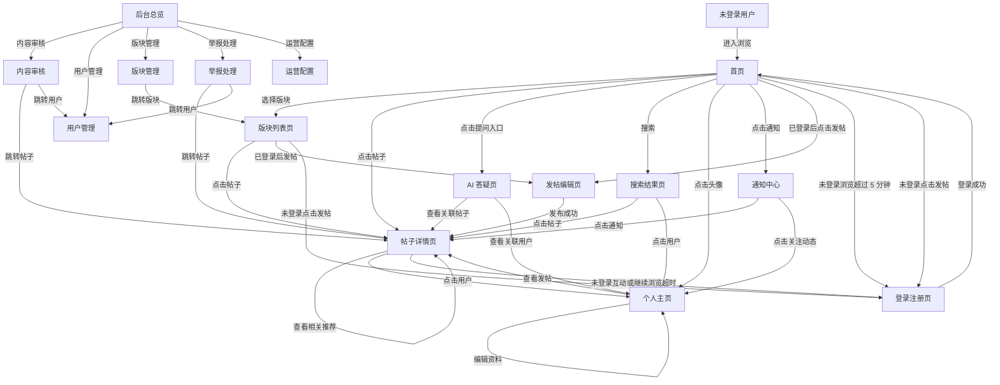

# AI 辅助论坛 · 信息架构文档

> 基于《AI 辅助论坛需求总结》整理，覆盖第一版全部前台用户页面与后台管理页面。

---

## 一、页面清单

### 前台页面

| 页面 | 用途 |
|------|------|
| 首页 | 展示个性化推荐内容、热门话题和版块入口，未登录用户可短时浏览 |
| 版块列表页 | 按板块分类浏览帖子，展示各版块下的话题和标签 |
| 帖子详情页 | 查看帖子正文、参与评论互动、查看 AI 讨论总结和相关推荐 |
| 发帖编辑页 | 已登录用户撰写和编辑帖子，调用 AI 辅助标题、润色、标签和版块建议 |
| AI 答疑页 | 用户提问后获得 AI 即时回答，展示引用来源并支持社区补充 |
| 搜索结果页 | 全站搜索帖子、回答、用户和知识库内容，AI 辅助聚合解释 |
| 个人主页 | 展示用户资料、发帖历史、收藏关注和社区影响力 |
| 通知中心 | 汇总评论回复、关注动态、系统通知和 AI 提醒 |
| 登录注册页 | 用户注册、登录和身份认证入口，也承接未登录浏览超时或发帖拦截 |

### 后台页面

| 页面 | 用途 |
|------|------|
| 后台总览 | 运营数据看板，展示社区健康度和关键指标趋势 |
| 内容审核 | 查看 AI 初审结果，处理人工审核队列中的待审内容 |
| 用户管理 | 查看用户信息、调整多级权限、处理违规用户 |
| 版块管理 | 创建和配置版块，设置分区治理规则和版主分配 |
| 举报处理 | 查看举报队列，审核和处理用户举报的内容 |
| 运营配置 | 配置推荐策略、AI 治理参数、知识库和社区规则 |

---

## 二、页面跳转关系

**跳转关系说明：**

- 首页是全局枢纽，可直达版块、帖子、答疑、搜索、个人主页、通知和发帖编辑器。
- 未登录用户可以进入首页并浏览内容，但不能发帖；未登录浏览超过 5 分钟时，系统强制显示认证入口。
- 帖子详情页是内容消费核心节点，评论互动、用户跳转和相关推荐都围绕它展开。
- AI 答疑页和搜索结果页都可作为内容发现入口，最终将用户引导至帖子详情页或个人主页。
- 发帖编辑器发布成功后直接跳转到新帖详情页。
- 后台五个管理页面均从后台总览进入，审核和举报处理过程中可跳转到前台对应帖子或用户。

---

## 三、访问权限规则

| 用户状态 | 可访问内容 | 受限行为 | 触发认证入口 |
|----------|------------|----------|--------------|
| 未登录 | 首页、版块列表、帖子详情、搜索结果的基础浏览 | 发帖、回复、点赞、收藏、关注、查看通知、编辑个人主页 | 浏览超过 5 分钟，或点击发帖、互动、关注等登录后能力 |
| 已登录 | 全部前台页面和用户互动功能 | 后台页面需要额外角色权限 | 登录态失效或访问越权页面 |
| 后台角色用户 | 按权限访问后台总览、审核、用户、版块、举报、运营配置 | 超出角色权限的后台操作 | 访问无权限模块时提示无权访问 |

---

## 四、页面核心模块

### 首页

- 顶部导航栏
- 推荐内容流
- 热门话题区
- 版块快捷入口
- AI 推荐位
- 未登录浏览计时器
- 认证入口弹层

### 版块列表页

- 版块导航
- 话题/标签筛选器
- 帖子列表
- 排序控件

### 帖子详情页

- 帖子正文区
- 评论区（楼中楼）
- 互动工具栏（点赞/收藏/举报）
- AI 讨论总结
- 相关推荐

### 发帖编辑页

- 内容编辑器
- AI 发帖助手面板
- 标签与版块选择器
- 预览与发布栏
- 登录态校验

### AI 答疑页

- 提问输入框
- AI 回答区（含来源引用）
- 社区补充回答区
- 相关问题推荐

### 搜索结果页

- 搜索栏
- 分类筛选（帖子/用户/知识库）
- 搜索结果列表
- AI 结果聚合摘要

### 个人主页

- 用户资料卡
- 内容列表（发帖/收藏/关注）
- 关注与粉丝
- 社区影响力指标

### 通知中心

- 通知分类标签
- 通知列表
- 通知设置

### 登录注册页

- 登录表单
- 注册表单
- 第三方登录入口
- 浏览超时提示
- 发帖拦截提示

### 后台总览

- 核心指标卡
- 内容趋势图
- 治理概览
- AI 使用统计

### 内容审核

- AI 初审结果列表
- 人工审核队列
- 审核操作工具
- 审核历史记录

### 用户管理

- 用户列表
- 用户详情
- 权限管理
- 处罚记录

### 版块管理

- 版块列表
- 版块配置
- 治理规则设置
- 版主分配

### 举报处理

- 举报队列
- 举报详情
- 处理操作工具

### 运营配置

- 推荐策略配置
- AI 治理参数
- 社区规则配置
- 知识库管理
